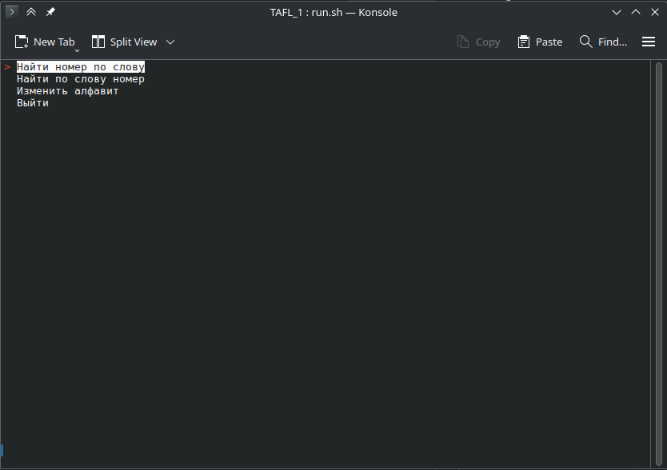
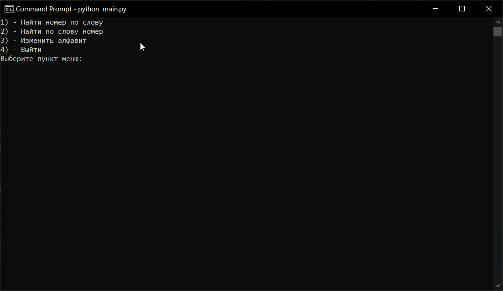
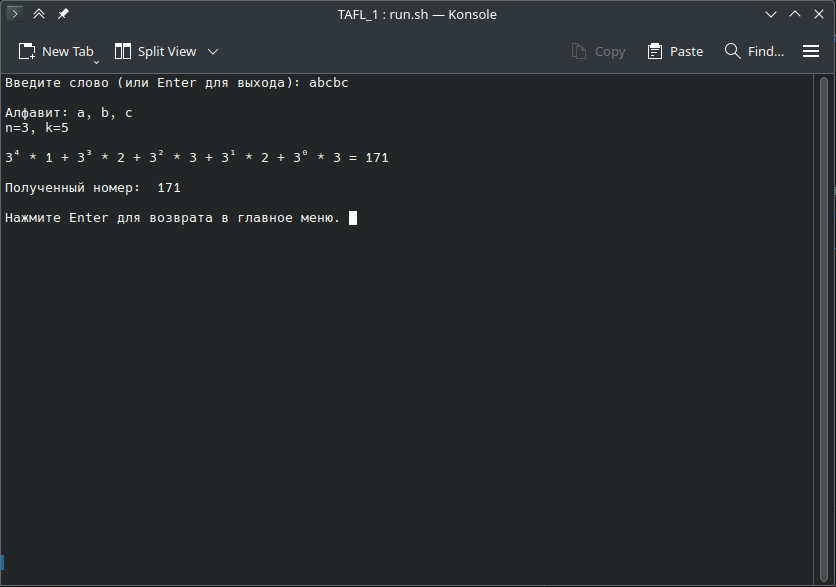
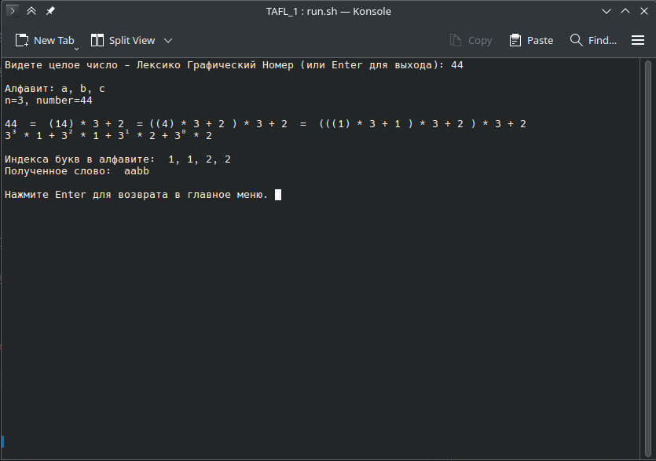

# Что за проект (RU)

Данный проект был создан, как лабораторная работа для университета по предмету "Теория автоматов и формальных языков".

В нем реализована система определения слова по его Лексикографическому номеру и наоборот (и детальные расчеты).

# Зависимости

Есть только одна необязательная зависимость `simple_term_menu` и служит только для красивого отображения меню. Работает только в Linux и только в терминале.

Если у вас другой случай, то будет работать более простое меню

# Запуск

`python main.py`

# Скриншоты

## Главное меню
Красивое меню (Linux)

Простое меню (Windows)

## Определение Лексикографический номер по слову

## Определение слово по Лексикографическому номеру

---

# What kind of project (ENG)

This project was created as a laboratory work for the university on the subject "Theory of automata and formal languages".

It implements a system for determining a word by its Lexicographic number and vice versa (and detailed calculations).

# Dependencies

There is only one optional dependency `simple_term_menu` and it only serves to display the menu beautifully. It works only on Linux and only in the terminal.

If you have a different case, then a simpler menu will work.

# Launch

`python main.py`

# Screenshots

## Main Menu
Beautiful menu (Linux)

Simple Menu (Windows)

## Definition of a lexicographic number by word

## Definition of a word by Lexicographic number

